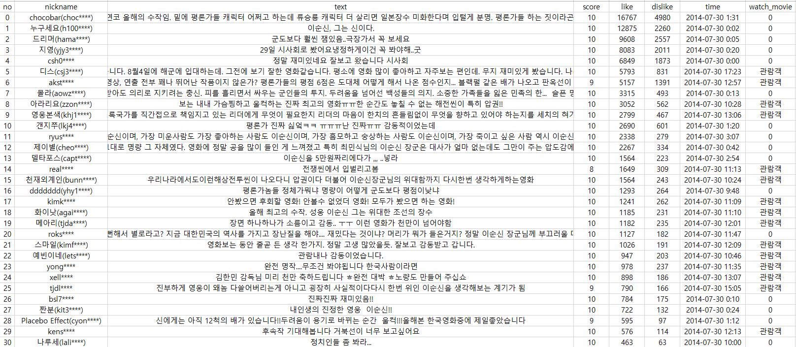

# 중국문화데이터포트폴리오 과제
  
  ## 1. 천만 영화 흥행이유 분석
  + 배경: 매해, 그리고 매월 영화는 개봉되지만, 어떤 영화는 1000만 관객을, 어떤 영화는 50만 관객도 채 못넘고 막을 내리기도 한다. 한국에서의 대박 흥행은 어느새 1000만 관객이 기준이 되어 버렸다.
  + 목적: 영화속에 들어있는 관객의 선호 현상을 텍스트마이닝 방법을 통해 밝힘으로써 한국 관객이 대부분 좋아하는 영화의 특징들을 탐색
  + 대상및 방법:상위 3위 천만 영화와 하위 3위 100만 영화에 대한 2000년 01월 01일부터 2020년 11월 30일까지의 댓글을 수집, 영화별로 분리하여 언어 분석(형태소 분석+Word2Vec) 수행 
1000만 영화와 100만 영화의 비교분석 
  + 데이터스키마
  

